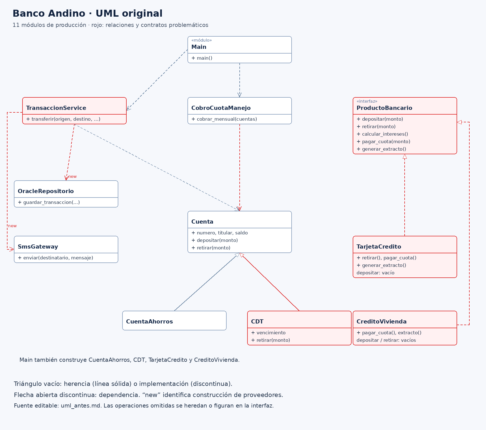
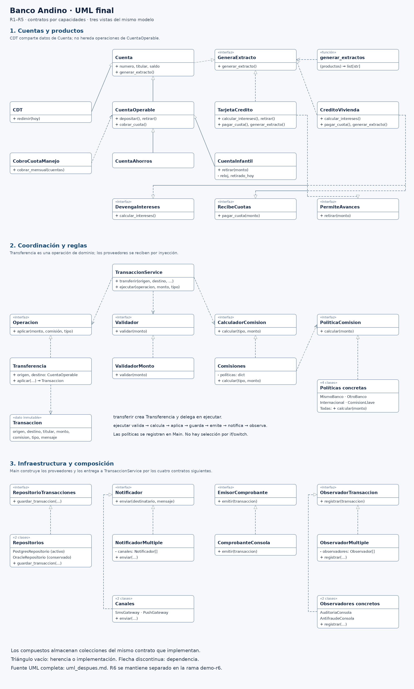

# Laboratorio L2: SOLID — Banco Andino

**Estudiante:** Ronald Arturo Chávez

**Asignatura:** Ingeniería de Software II

**Universidad Nacional de Colombia, sede Bogotá — 2026**

**Repositorio:** https://github.com/RonaldChavez5/IngeSoft2

## Introducción

En este laboratorio analicé el backend de Banco Andino para identificar sus
problemas de diseño y corregirlos mediante los principios SOLID. Después
incorporé los requerimientos del negocio y comprobé los resultados con pruebas.

Elegí Python 3.12 porque me permite trabajar con clases, contratos y pruebas
unitarias sin instalar librerías adicionales. Conservé en la traducción inicial
los problemas del código Java para poder comparar el diseño antes y después.
Organicé la refactorización y los requerimientos R1 a R5 en la rama `main`.
La implementación de R6 está en la rama `demo-r6`.

## Ejecución del proyecto

Utilicé estos comandos desde la carpeta del repositorio para ejecutar el programa
y sus pruebas:

```bash
python main.py
python -m unittest discover -v
```

Para comparar las salidas de los controles y consultar el historial, utilicé:

```bash
python scripts/verificar_historial.py
git log --oneline --all --graph
```

Conservé las etiquetas de cada etapa para consultar sus versiones. Oracle,
PostgreSQL, SMS, push y antifraude están simulados con mensajes en consola.

## Bloque 0. Código base

Traduje los 11 archivos del ejemplo a Python. Usé `ValueError` para los argumentos
inválidos, `RuntimeError` para el saldo insuficiente y `NotImplementedError`
para el retiro no permitido del CDT. Conservé los saldos como `float`, siguiendo
el uso de `double` en el código original.

Al ejecutar el programa, comprobé que la transferencia de Ana a Luis mueve
$150.000 y cobra $7.500 de comisión. Después se descuentan $12.900 de cuota
de manejo a cada cuenta. Los saldos finales son $1.829.600 para Ana y $637.100
para Luis.

Guardé el resultado en [salida_original.txt](salida_original.txt). Para las
comparaciones posteriores tomé como referencia esta versión de Python e ignoré
únicamente la fecha y hora de auditoría. En la demostración usé un CDT con
vencimiento 183 días después de su creación.

## Bloque 1. Diagnóstico

### Hallazgos

Identifiqué los siguientes problemas y sus consecuencias:

| Clase o método | Principio | Evidencia | Consecuencia |
|---|---|---|---|
| `TransaccionService.transferir` | S | Valida, calcula comisión, mueve dinero, guarda, imprime, notifica y audita. | Un cambio en el comprobante obliga a tocar el método que también descuenta el dinero. |
| `TransaccionService.transferir` | O | Selecciona la comisión con una cadena `if/elif`, equivalente al `switch` de Java. | Cada tipo nuevo exige modificar código que ya funciona. |
| `CDT.retirar` | L | Añade una restricción de vencimiento que no existe en la cuenta base. | Un CDT puede detener el cobro mensual aunque tenga saldo suficiente. |
| `ProductoBancario` | I | Exige operaciones que no corresponden a todos los productos. | El contrato permite solicitar movimientos que el producto no realiza. |
| `TarjetaCredito.depositar` y `CreditoVivienda.depositar/retirar` | I | Son tres métodos vacíos. | Una llamada puede terminar sin error, aunque no haya hecho nada. |
| `TransaccionService.__init__` | D | Construye directamente `OracleRepositorio` y `SmsGateway`. | Probar una comisión ejecuta también los proveedores; reemplazarlos obliga a editar el servicio. |
| `CobroCuotaManejo.cobrar_mensual` | L | Acepta cualquier `Cuenta`, incluidos los CDT. | Puede dejar el lote incompleto al recibir una cuenta que no permite el retiro. |

### Experimento con el CDT

Coloqué el CDT entre las cuentas de Ana y Luis. Observé que primero se cobra a
Ana, cuyo saldo queda en $1.987.100. Después el CDT lanza `NotImplementedError`
y detiene el proceso. Luis conserva sus $500.000 porque no alcanza a ser procesado.

Si el CDT fuera la cuenta 500.000, las primeras 499.999 podrían haber sido
cobradas y las siguientes quedarían sin procesar. También identifiqué un riesgo
al repetir el lote completo: volver a cobrar las cuentas que ya se procesaron.

Registré el resultado en [experimento_cdt.txt](docs/experimento_cdt.txt).

### Prueba de la comisión sin Oracle ni SMS

Pude comprobar la comisión de $7.500, pero al hacerlo también se ejecutaron
Oracle y SMS. Aunque en el laboratorio son simulaciones, el constructor no
permite reemplazarlos directamente por dobles de prueba.

Consideré que en Python podría usar `patch` o reasignar los atributos. Sin
embargo, eso haría que la prueba dependiera de los detalles internos del
servicio. Por eso identifiqué el problema como una dependencia del diseño.

Registré el resultado en
[experimento_acoplamiento.txt](docs/experimento_acoplamiento.txt).

### Medición inicial

| Métrica | Antes |
|---|---:|
| Líneas de `transferir` | 38 |
| Razones de cambio de `TransaccionService` | 7 |
| Clases concretas que construye el servicio | 2 |
| Métodos vacíos o con rechazo por «no aplica» | 4 |
| ¿Se prueba sin Oracle ni SMS mediante inyección? | No |
| Archivos de producción | 11 |

Conté las líneas físicas desde `def` hasta la última instrucción, incluidos los
comentarios y blancos internos. En los cuatro métodos problemáticos incluí los
tres vacíos y el retiro del CDT. No conté las declaraciones abstractas como
métodos vacíos. Las siete razones de cambio corresponden a las siete tareas
del método original.

Incluí el diagrama en [UML original](docs/uml_antes.md).

## Bloque 2. Refactorización

### Control S: responsabilidad única

Separé las tareas para que `TransaccionService` coordine el procesamiento de
una transacción. Dejé la validación, las comisiones, el movimiento del dinero,
el comprobante y los proveedores en colaboradores diferentes.

La frase que resume el servicio es: «Coordina el procesamiento de una
transacción». No necesita unir varias responsabilidades con «y». Si cambia el
formato legal del comprobante, modifico `comprobante_consola.py`.

Usé `Transferencia` para mover el dinero y `Transaccion` para conservar los datos
del resultado. Dejé el orden de los pasos en `ejecutar`, que también puede
utilizarse para otras operaciones.

### Control O: abierto a extensión, cerrado a modificación

Reemplacé la selección por tipos con un registro de políticas de comisión.
Para agregar otro tipo, creo su política y la registro en `main.py`. Ese es
el único archivo existente que necesito modificar para conectarla.

Así mantengo sin cambios el servicio y el selector `Comisiones`. También
conservé el rechazo de los tipos desconocidos.

### Control L: sustitución de Liskov

Separé los datos comunes de las operaciones que requieren dinero disponible.
Dejé los datos en `Cuenta` y el depósito, retiro y cobro de cuota en
`CuentaOperable`. `CuentaAhorros` pertenece a esta segunda rama.

El CDT hereda de `Cuenta` y tiene `redimir(hoy)`, que expresa su condición de
vencimiento. De esta forma, no pertenece al tipo admitido para transferir ni
para cobrar la cuota mensual.

En Python, las anotaciones no impiden por sí solas una llamada incorrecta.
Un verificador como mypy puede detectarla antes de ejecutar; sin él, el error
aparece en ejecución. No incluí una comprobación estática con mypy en las
pruebas del laboratorio.

Prefiero detectar ese uso antes de ejecutar porque evita descubrirlo a mitad
de un lote. Capturar la excepción e ignorar los CDT no corregiría el contrato
y dejaría abierta la posibilidad de repetir el error en otra operación.

### Control I: segregación de interfaces

Usé `GeneraExtracto` para que el mismo generador trabaje con cuentas, tarjetas
y créditos. Solo necesita `generar_extracto()`, por lo que no depende de
operaciones de depósito, retiro o pago.

Separé las demás capacidades en `DevengaIntereses`, `RecibeCuotas` y
`PermiteAvances`. Eliminé los métodos vacíos por «no aplica». En Python, una
clase cumple un protocolo al ofrecer los métodos requeridos, sin tener que
heredar explícitamente de él.

### Control D: inversión de dependencias

Hice que el servicio reciba seis colaboradores mediante contratos. Concentré
la selección de implementaciones en `construir_servicio`, dentro de `main.py`.
Allí decido qué repositorio, notificador, comprobante y observador utilizar.

El servicio ya no construye proveedores concretos. Todavía construye una
`Transferencia`, que es una operación del dominio, y utiliza `Transaccion`
como resultado. Por eso distingo entre cero proveedores construidos y una
clase concreta construida si cuento también esa operación.

Con este cambio pude volver al experimento del bloque 1 y probar la comisión
con dobles, sin modificar el servicio ni ejecutar Oracle o SMS.

### Comprobación del comportamiento

Comparé la salida después de cada control y obtuve el mismo resultado que en
el programa original, salvo la fecha y hora de auditoría. Guardé las cinco
salidas y sus comparaciones en `docs/salidas/`.

## Bloque 3. Pruebas unitarias

Implementé las cinco pruebas obligatorias en `tests/test_transferencias.py`:

1. Transferencia al mismo banco: comisión cero y movimiento exacto del monto.
2. Transferencia a otro banco: comisión de $7.500 y descuento de monto más comisión.
3. Saldo insuficiente: rechazo sin guardar ni notificar.
4. Transferencia exitosa: un registro y una notificación.
5. Tipo desconocido: rechazo sin modificar el saldo.

Usé `RepositorioMemoria`, `NotificadorEspia`, `ComprobanteEspia` y
`ObservadorEspia`. Estos dobles registran las llamadas para comprobar lo ocurrido,
sin ejecutar los proveedores externos simulados.

No necesité cambiar ninguna línea de `TransaccionService` para escribir las
pruebas. En el código original habría tenido que parchear sus dependencias
internas o ejecutar Oracle y SMS.

Guardé la ejecución de las cinco pruebas en
[pruebas_bloque_3.txt](docs/pruebas_bloque_3.txt). Con las pruebas adicionales de
requerimientos y contratos, obtuve **23 pruebas correctas en `main`**. El tiempo
registrado fue de **0,002 segundos**, sin contar el arranque de Python. Este
valor puede variar según el equipo.

Resultado final: [pruebas_finales.txt](docs/pruebas_finales.txt).

## Bloque 4. Requerimientos del negocio

### Cambios implementados

| Requerimiento | Implementación |
|---|---|
| R1. Transferencias por llave | Agregué `ComisionLlave` con comisión cero. Una transferencia de $50.000 descuenta exactamente $50.000. No implementé búsqueda de cuentas por llave, de acuerdo con el alcance del ejercicio. |
| R2. Cuenta infantil | Agregué el acumulado diario de retiros y el límite de $200.000. Comprobé que un retiro rechazado conserva el saldo y que la cuenta puede recibir depósitos, transferir y pagar su cuota. |
| R3. Notificaciones push | Conecté SMS y push mediante `NotificadorMultiple`. Cada canal recibe un aviso por operación exitosa. |
| R4. Antifraude | Conecté auditoría y antifraude mediante `ObservadorMultiple`. Las transferencias rechazadas no generan esos registros. |
| R5. PostgreSQL | Agregué `PostgresRepositorio` y cambié la configuración de `main.py`. Conservé Oracle y las cinco pruebas originales sin modificaciones. |

Para la cuenta infantil tomé el día del reloj inyectado. Incluí la comisión en
el importe del retiro y dejé la cuota administrativa separada del límite diario.
La cuota se cobra si hay saldo. También comprobé que los depósitos no reinician
el acumulado de retiros.

Conservé la línea de conexión del SMS y un único mensaje al cliente por operación.
Apliqué auditoría y antifraude a las transacciones que pasan por el servicio.
Los depósitos, retiros directos y cuotas administrativas quedan fuera de ese
flujo en este modelo.

### Tabla de cambios

Antes de implementar cada requerimiento estimé los archivos que tendría que
modificar en el código original. Después conté los cambios reales del diseño
refactorizado. Separé los archivos de producción de los de pruebas.

| Req. | Existentes a modificar en el original, estimado | Existentes modificados, real | Producción nueva | Pruebas nuevas | ¿Se rompió alguna prueba? |
|---|---:|---:|---:|---:|---|
| R1 | 2 | 1 | 1 | 1 | No |
| R2 | 3 | 1 | 1 | 1 | No |
| R3 | 1 | 1 | 2 | 1 | No |
| R4 | 1 | 1 | 2 | 1 | No |
| R5 | 1 | 1 | 1 | 1 | No |

En los cinco requerimientos modifiqué únicamente `main.py` entre los módulos
existentes: fueron **cinco intervenciones sobre un archivo distinto**.
Agregué siete módulos de producción y cinco archivos de pruebas. Conservé sin
cambios las cinco pruebas del bloque 3.

Para R2 estimé tres modificaciones en el original porque consideré necesario
separar el retiro de la cuota y resolver la compatibilidad de las cuentas.
Una subclase que solo cubriera el caso mínimo podría necesitar menos cambios.
Las cifras del original son estimaciones, no resultados de una segunda implementación.

Guardé las estimaciones en `docs/estimaciones/`, los conteos en
`docs/cambios_req_*.json` y las ejecuciones en `docs/pruebas_req_1.txt` a
`docs/pruebas_req_5.txt`.

## Bloque 5. Extensión R6

Implementé el pago de servicios públicos sobre mi proyecto en la rama `demo-r6`.
Agregué `PagoServicio` y `ComisionServicios`, y conecté el nuevo tipo desde
`main.py`. No modifiqué `TransaccionService` ni copié su lógica.

Reutilicé `ejecutar` para validar el monto, calcular la comisión, guardar la
transacción, generar el comprobante, notificar y registrar los eventos de
auditoría y antifraude. En `PagoServicio` dejé únicamente el movimiento
específico del pago y los datos de la factura.

Comprobé que un pago de $184.300 descuenta **$185.800**, incluyendo la comisión
fija de $1.500. El comprobante utiliza la referencia de la factura como destino.
También comprobé el rechazo de montos inválidos, saldo insuficiente, un CDT
como origen y un pago que exceda el límite de la cuenta infantil.

La rama `demo-r6` contiene **28 pruebas correctas**. Para ejecutarla utilicé:

```bash
git switch demo-r6
python main.py
python -m unittest discover -v
git switch main
```

## Bloque 6. Cierre

### Diagramas UML

Comparé la estructura original con el diseño final:

| Antes | Después |
|---|---|
|  |  |

Incluí las versiones detalladas en [UML original](docs/uml_antes.md) y
[UML final](docs/uml_despues.md). También preparé
[uml_comparacion.html](docs/uml_comparacion.html) para ver ambos diagramas
lado a lado en un navegador local.

### Comparación final

| Métrica | Antes | Después, rama `main` |
|---|---:|---:|
| Líneas de `transferir` | 38 | 3 |
| Líneas de `transferir` más `ejecutar` | 38 | 13 |
| Razones de cambio del servicio | 7 | 1: coordinar el flujo |
| Clases concretas que construye el servicio | 2 | 1: `Transferencia` |
| Proveedores concretos que construye el servicio | 2 | 0 |
| Métodos vacíos o con rechazo por «no aplica» | 4 | 0 |
| ¿Se prueba sin Oracle ni SMS mediante inyección? | No | Sí |
| Archivos de producción | 11 | 28 |
| Archivos versionados, incluidas pruebas y documentación | 13 | 87 |
| Archivos existentes modificados en el bloque 4 | No aplica | 5 intervenciones; 1 archivo distinto |

Al reducir `transferir` no eliminé la lógica: la distribuí entre `ejecutar`
y sus colaboradores. Por eso incluí también la suma de ambos métodos.
Guardé el inventario en [inventario_versionado.txt](docs/inventario_versionado.txt).

### a) ¿Es un problema tener más archivos?

No lo considero un problema por sí solo. Ahora puedo localizar cada
responsabilidad sin recorrer un método que lo hace todo. Sí sería un problema
si creara muchas clases sin una función clara. Por eso agrupé los protocolos
relacionados y evité crear un archivo para cada método.

Las capacidades de intereses, cuotas y avances todavía no tienen un consumidor
en el programa principal. Si buscara el diseño mínimo para un proyecto pequeño,
evaluaría incorporarlas cuando apareciera esa necesidad.

### b) ¿En qué requerimiento noté más la diferencia?

En R5, porque cambié a PostgreSQL sin editar el servicio ni las cinco pruebas
iniciales. Solo agregué el repositorio y cambié la configuración de `main.py`.
Además, conservé Oracle para poder volver a utilizarlo.

En R3 y R4 también agregué proveedores sin cambiar el flujo principal. Los cinco
requerimientos modificaron la misma cantidad de archivos existentes; la ventaja
que observé está en no tocar el servicio para conectar esas implementaciones.

### c) ¿Qué parte del diseño mejoraría?

R2 me llevó a precisar cómo tratar la comisión y la cuota de manejo frente al
límite diario. La separación entre retiro y cuota me permitió aplicar esas
reglas sin modificar el servicio.

Para un sistema real también mejoraría el manejo de fallos: si un proveedor
falla después de mover el dinero, el diseño actual no revierte el movimiento.
Incorporaría transacciones de base de datos y controles para evitar duplicados
al reintentar. Usaría dinero decimal y validaría valores no finitos.
Conservé el límite original de $5 millones por operación, aunque su mensaje
lo llame «diario».

### d) ¿Qué observo al revisar individualmente mi diseño?

La separación que encuentro más útil es la del movimiento de dinero frente a
los proveedores. En R6 pude reutilizar el flujo existente y agregar el pago
sin cambiar el servicio.

También veo un punto que podría simplificar: los contratos de intereses,
cuotas y avances expresan las capacidades de los productos, pero todavía no
tienen consumidores en el programa principal. Mantendría esa observación como
criterio para evitar abstracciones innecesarias en una siguiente versión.

### e) ¿Cómo justificaría la refactorización ante el jefe?

Mostraría los resultados: conservé la salida en los cinco controles, pude
probar las reglas sin proveedores externos y agregué los cinco requerimientos
sin modificar el servicio. Con estos datos explicaría que el diseño facilita
revisar cambios y reduce las partes que pueden verse afectadas.

Para justificar dos semanas de trabajo también mediría el tiempo de los cambios
y los errores del sistema real. No usaría solamente el aumento de archivos o
la reducción de líneas como argumento.

## Referencias

- `Laboratorio_SOLID.pdf`: enunciado, bloques y rúbrica de la actividad.
- `Requerimientos_SOLID.pdf`: criterios de aceptación de R1 a R6.
