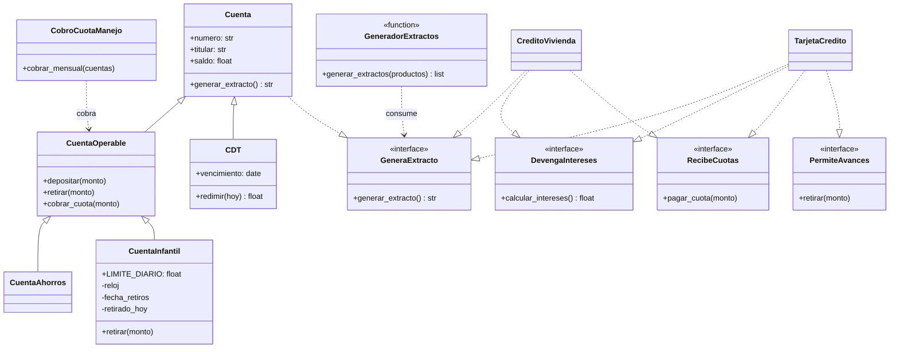
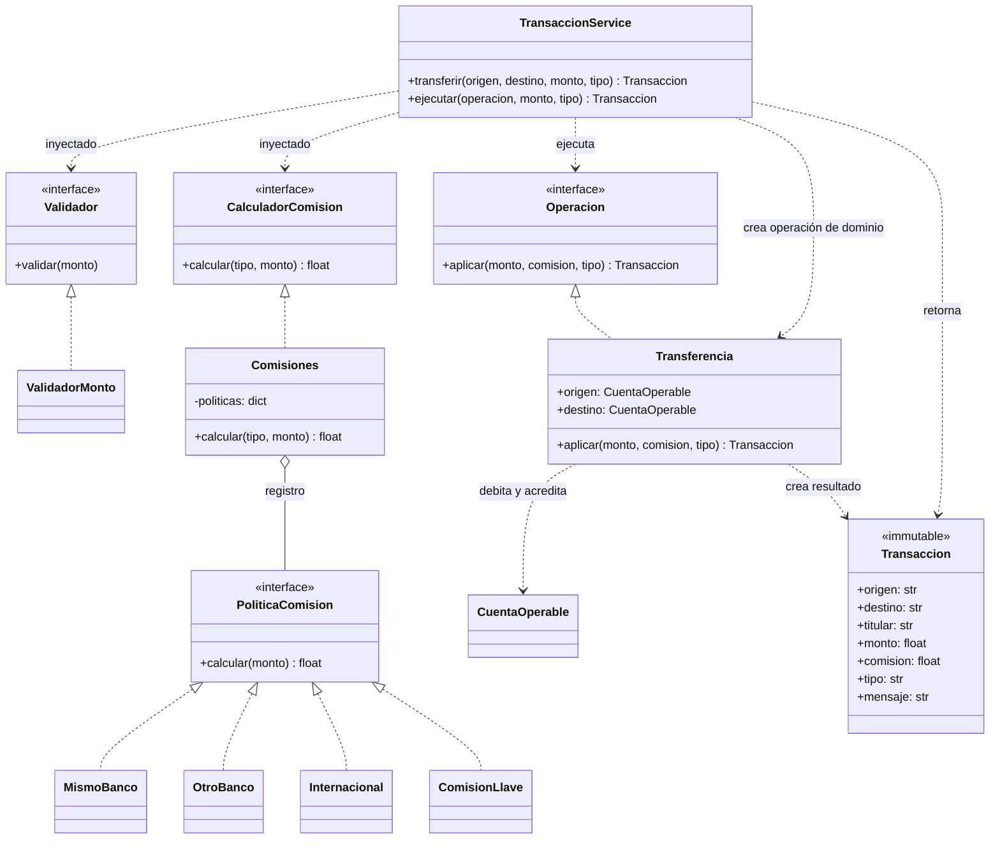
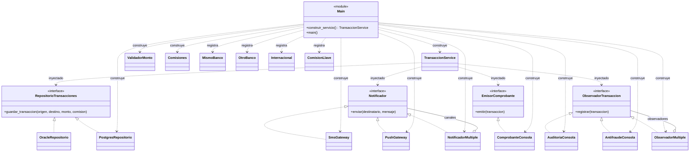

# UML final - rama main, R1 a R5

Las interfaces `Protocol` se implementan estructuralmente: tener los métodos
indicados cumple el contrato, sin una cláusula `implements` explícita.
Se muestran tres vistas del mismo modelo para mantener legibles sus relaciones.
La demostración R6 agrega `PagoServicio ..|> Operacion` y
`ComisionServicios ..|> PoliticaComision`; solo se encuentra en `demo-r6`.

## Dominio y capacidades

## Flujo y comisiones

## Infraestructura y composición

